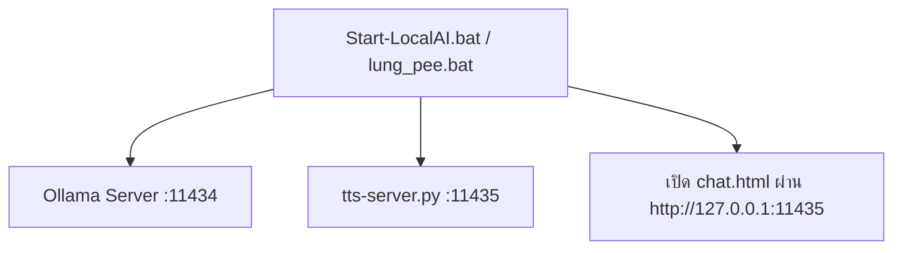
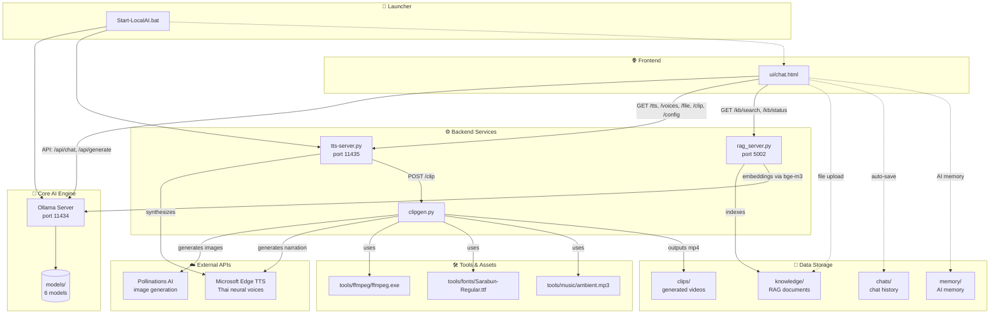

# LocalAI System Architecture — ความสัมพันธ์ระหว่างคอมโพเนนต์

> ภาพรวม: ระบบ AI ทำงาน offline 100% (บางฟีเจอร์ต่อเน็ต) บน external HDD

---

## 🎯 จุดเริ่มต้น (Entry Points)



---

## 🏗 โครงสร้างระบบ (System Components)



---

## 🔗 ตารางความสัมพันธ์รายละเอียด

| Component | Role | Port | Dependencies | Outputs |
|-----------|------|------|--------------|---------|
| **Start-LocalAI.bat** | Launcher | - | ollama.exe, python, tts-server.py | เริ่ม Ollama + TTS + เปิด UI |
| **Ollama Server** | LLM Inference | 11434 | models/ (6 models) | Text generation, embeddings |
| **tts-server.py** | Multi-purpose Backend | 11435 | edge-tts, clipgen.py, ffmpeg | TTS, file reading, clip generation, config, proxy |
| **rag_server.py** | RAG Backend | 5002 | Ollama (bge-m3), knowledge/ | Semantic search, indexing |
| **clipgen.py** | Video Generator | - | Pollinations, edge-tts, ffmpeg, fonts, music | MP4 clips |
| **ui/chat.html** | Frontend UI | Served by tts-server.py | All backends | User interaction |

---

## 📦 โมเดลที่ติดตั้ง (6 ตัว)

| โมเดล | ขนาด | VRAM | ใช้ทำ |
|--------|------|------|-------|
| `scb10x/typhoon2.5-qwen3-4b` | ~2.5GB | 2.3GB | ไทย (เร็วสุด, 39.5 tok/s) |
| `qwen2.5-coder:3b` | ~2GB | 2.1GB | โค้ด (เร็ว, 36.4 tok/s) |
| `qwen2.5-coder:7b` | ~4.7GB | 5.0GB | โค้ดคุณภาพสูง (12.5 tok/s) |
| `qwen2.5:7b` | ~4.7GB | 5.0GB | ทั่วไป |
| `moondream` | ~1.7GB | 1.7GB | Vision (อ่านรูป) |
| `bge-m3` | ~1.2GB | 1.2GB | Embedding (RAG) |

---

## 🔌 API Endpoints Map

### tts-server.py (port 11435)
```
GET  /health              -> "ok"
GET  /voices              -> รายชื่อเสียงไทย (Premwadee/Niwat)
GET  /tts?text=&voice=    -> audio/mpeg (MP3)
POST /tts {text, voice}   -> audio/mpeg
GET  /file?path=          -> เนื้อหาไฟล์/โฟลเดอร์ (text/CSV/Excel/HTML-table)
POST /clip {scenes...}    -> video/mp4
GET  /config              -> โหลด config จาก model.md
POST /config {cfg}        -> บันทึก config ลง model.md
GET  /proxy?url=          -> ดึงบทความจากเว็บ (bypass CORS)
GET  /*                   -> เสิร์ฟ static files จาก ui/
```

### rag_server.py (port 5002)
```
GET  /kb/status           -> {chunks, files, indexed_at}
GET  /kb/search?q=&k=4    -> {hits: [{text, source, score}]}
POST /kb/reindex          -> rebuild index
```

### Ollama (port 11434)
```
POST /api/chat            -> chat completion
POST /api/generate        -> single completion
POST /api/embeddings      -> embeddings (bge-m3)
GET  /api/tags            -> list models
POST /api/pull            -> download model
```

---

## 🔄 Data Flow: ฟีเจอร์หลัก

### 1. แชททั่วไป (Chat)
```
User -> chat.html -> Ollama (port 11434) -> Model -> Response -> chat.html
```

### 2. เสียง Neural (TTS)
```
User -> chat.html -> tts-server.py (/tts) -> edge-tts (cloud) -> MP3 -> chat.html
```

### 3. RAG (Knowledge Base)
```
User uploads docs -> knowledge/ -> rag_server.py indexes -> bge-m3 embeddings via Ollama
User query -> chat.html -> rag_server.py (/kb/search) -> relevant chunks -> Ollama -> Response
```

### 4. สร้างคลิป (Clip Generation)
```
User: "ทำคลิป..." -> chat.html -> tts-server.py (/clip) -> clipgen.py
  -> Pollinations (images) + edge-tts (narration) -> ffmpeg (combine) -> clips/gen_*.mp4
```

### 5. อ่านไฟล์ในเครื่อง (File Access)
```
User types path -> chat.html -> tts-server.py (/file?path=) -> reads file -> text -> chat.html -> Ollama
```

---

## 📁 โครงสร้างไฟล์สำคัญ

```
F:\LocalAI\
├── 🚀 Launcher
│   ├── Start-LocalAI.bat
│   └── lung_pee.bat
├── 🧠 Core
│   ├── ollama/ollama.exe
│   └── models/ (6 models)
├── ⚙️ Backend
│   ├── tts-server.py          # Main backend (port 11435)
│   ├── rag_server.py          # RAG backend (port 5002)
│   └── clipgen.py             # Video generator
├── 🌐 Frontend
│   └── ui/
│       ├── chat.html          # Main UI
│       ├── lib/               # pdf.js, xlsx, chart.js
│       └── plugins/           # Plugin system
├── 🛠 Tools
│   └── tools/
│       ├── ffmpeg/ffmpeg.exe
│       ├── fonts/Sarabun-Regular.ttf
│       └── music/ambient.mp3
├── 📁 Data
│   ├── knowledge/             # RAG documents
│   ├── clips/                 # Generated videos
│   ├── chats/                 # Chat history (JSON)
│   └── memory/                # AI memory
└── 📄 Config
    ├── model.md               # Config backup (JSON in markdown)
    └── README.txt
```

---

## ⚙️ Environment Variables (ตั้งใน .bat)

```bat
OLLAMA_MODELS=F:\LocalAI\models
OLLAMA_HOME=F:\LocalAI\ollama-data
OLLAMA_HOST=127.0.0.1:11434
OLLAMA_FLASH_ATTENTION=1
OLLAMA_KV_CACHE_TYPE=q8_0
OLLAMA_ORIGINS=*
OLLAMA_KEEP_ALIVE=5m
```

---

## 🎯 สรุปความสัมพันธ์สำคัญ

1. **Start-LocalAI.bat** = จุดเริ่มต้นเดียว สตาร์ททุกอย่าง
2. **Ollama (11434)** = หัวใจ LLM + Embeddings
3. **tts-server.py (11435)** = Backend กลาง จัดการ TTS, File, Clip, Config, Proxy, Static files
4. **rag_server.py (5002)** = Backend เฉพาะ RAG (แยกเพื่อไม่บล็อก port หลัก)
5. **chat.html** = Frontend เดียว เรียกทุก backend ผ่าน HTTP
6. **clipgen.py** = ใช้โดย tts-server.py ผ่าน `import clipgen` + `importlib.reload`
7. **External APIs**: Pollinations (รูป) + Edge TTS (เสียง) ต้องต่อเน็ต

---

## 🔧 การพัฒนา/แก้ไข

| ต้องการแก้ | ไฟล์ที่แก้ |
|------------|-----------|
| UI/ฟีเจอร์แชท | `ui/chat.html` |
| TTS/เสียง/ไฟล์/คลิป/Config | `tts-server.py` |
| RAG/ค้นหาความรู้ | `rag_server.py` |
| สร้างคลิป/FFmpeg | `clipgen.py` |
| เริ่มต้น/ENV | `Start-LocalAI.bat` |
| โมเดล | `ollama\ollama.exe pull <model>` |
| ฟอนต์ซับไทย | `tools/fonts/Sarabun-Regular.ttf` |